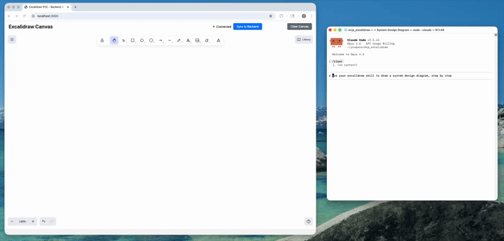

# Excalidraw MCP Server & Agent Skill

[](https://github.com/wtf403/excalidrop/actions/workflows/ci.yml)
[](https://www.npmjs.com/package/excalidrop)
[](LICENSE)

Run a live Excalidraw canvas and control it from AI agents. This repo provides:

- **MCP Server**: Connect via Model Context Protocol (Claude Desktop, Cursor, Codex CLI, etc.)
- **Agent Skill**: Portable skill for Claude Code, Codex CLI, and other skill-enabled agents

Keywords: Excalidraw agent skill, Excalidraw MCP server, AI diagramming, Claude Code skill, Codex CLI skill, Claude Desktop MCP, Cursor MCP, Mermaid to Excalidraw.

## Demo



## Table of Contents

- [Demo](#demo)
- [What It Is](#what-it-is)
- [How We Differ from the Official Excalidraw MCP](#how-we-differ-from-the-official-excalidraw-mcp)
- [What's New](#whats-new)
- [Quick Start (Local)](#quick-start-local)
- [Configure MCP Clients](#configure-mcp-clients)
  - [Claude Desktop](#claude-desktop)
  - [Claude Code](#claude-code)
  - [Cursor](#cursor)
  - [Codex CLI](#codex-cli)
  - [OpenCode](#opencode)
  - [Antigravity (Google)](#antigravity-google)
- [Agent Skill (Optional)](#agent-skill-optional)
- [MCP Tools (26 Total)](#mcp-tools-26-total)
- [Testing](#testing)
- [Troubleshooting](#troubleshooting)
- [Known Issues / TODO](#known-issues--todo)
- [Development](#development)

## What It Is

Remote-only: GitHub is the canvas. No local server, no ports.

- Viewer: static Excalidraw app on GitHub Pages (public repos) or Cloudflare Pages (private repos), reads `canvas.excalidraw` from the `excalidrop` branch
- MCP server: remote-only stdio (`npx -y excalidrop@latest mcp --repo owner/repo`); draws via GitHub Contents API, screenshots via shared relay when a viewer tab is open

## How We Differ from the Official Excalidraw MCP

Excalidraw now has an [official MCP](https://github.com/excalidraw/excalidraw-mcp) — it's great for quick, prompt-to-diagram generation rendered inline in chat. We solve a different problem.

| | Official Excalidraw MCP | This Project |
|---|---|---|
| **Approach** | Prompt in, diagram out (one-shot) | Programmatic element-level control (26 tools) |
| **State** | Stateless — each call is independent | Persistent live canvas with real-time sync |
| **Element CRUD** | No | Full create / read / update / delete per element |
| **AI sees the canvas** | No | `describe_scene` (structured text) + `get_canvas_screenshot` (image) |
| **Iterative refinement** | No — regenerate the whole diagram | Draw → look → adjust → look again, element by element |
| **Layout tools** | No | `align_elements`, `distribute_elements`, `group / ungroup` |
| **File I/O** | No | `export_scene` / `import_scene` (.excalidraw JSON) |
| **Snapshot & rollback** | No | `snapshot_scene` / `restore_snapshot` |
| **Mermaid conversion** | No | `create_from_mermaid` |
| **Shareable URLs** | Yes | Yes — `export_to_excalidraw_url` |
| **Design guide** | `read_me` cheat sheet | `read_diagram_guide` (colors, sizing, layout, anti-patterns) |
| **Viewport control** | Camera animations | `set_viewport` (zoom-to-fit, center on element, manual zoom) |
| **Live canvas UI** | Rendered inline in chat | Standalone Excalidraw app synced via WebSocket |
| **Multi-agent** | Single user | Multiple agents can draw on the same canvas concurrently |
| **Works without MCP** | No | Yes — REST API fallback via agent skill |

**TL;DR** — The official MCP generates diagrams. We give AI agents a full canvas toolkit to build, inspect, and iteratively refine diagrams — including the ability to see what they drew.

## Quick Start

```bash
npx excalidrop              # interactive TUI: repo → auth → host → editor
# or one-shot:
npx excalidrop setup owner/repo [--target pages|cloudflare]
```

`setup` walks you through the whole flow on **any repo you own or can access**:

1. **Checks `gh auth`** (log in with `gh auth login` first — 2FA via GitHub, or `npx excalidrop login` device flow).
2. **Picks a host** (recommended from visibility: public→GitHub Pages, private→Cloudflare Pages; override with `--target`). Publishes the viewer once — later saves never redeploy.
3. Repo access == canvas access: collaborators with write can edit, readers get view-only, everyone else gets a login wall.
4. Writes `.mcp.json` + remembers the repo in `.excalidrop.json`, so the MCP preloads it and subsequent sessions draw directly. Commits land on GitHub; the viewer updates itself.

No install needed — editors run the MCP straight from npm:

```bash
claude mcp add excalidrop --scope project -- npx -y excalidrop@latest mcp --repo owner/repo
codex mcp add excalidrop -- npx -y excalidrop@latest mcp --repo owner/repo
```

Screenshots / viewport / mermaid need one viewer tab open (shared relay at `excalidrop.wtf403.workers.dev`); drawing works headless.

### Migrating public↔private

Flipping repo visibility doesn't move canvas data (it stays on the `excalidrop` branch) — only the viewer host changes. GitHub Pages serves private repos only on paid plans, so private repos use Cloudflare Pages. The TUI detects the flip (stored target in `.excalidrop.json` vs current visibility) and pre-selects the right host.

**Public → private:**

1. `gh repo edit owner/repo --visibility private` (or repo Settings).
2. `npx excalidrop setup owner/repo --target cloudflare` (needs `wrangler login` once). New URL: `https://excalidrop-owner-repo.pages.dev/?repo=owner/repo`.
3. Anonymous viewing ends: private scenes need a token, so every viewer must log in and the Excalidrop app must be installed on the repo.
4. Add the new `https://<project>.pages.dev/` callback URL in your GitHub App / OAuth App settings (exact match).
5. The old `owner.github.io/repo` URL 404s — optionally disable Pages (Settings → Pages) to avoid confusion.

**Private → public:**

1. `gh repo edit owner/repo --visibility public`.
2. Either stay on Cloudflare (keeps working; anonymous reads start working once public) or move back to zero-config: `npx excalidrop setup owner/repo --target pages`.
3. If you move back, optionally delete the Cloudflare project (`npx -y wrangler@4 pages project delete <project>`) so two live URLs don't drift.

## Configure MCP Clients

The MCP server runs over stdio (remote-only) and can be configured with any MCP-compatible client. The recommended path is `npx excalidrop setup owner/repo` (writes `.mcp.json` + auto-installs), which replaces the manual setups below.

### Environment Variables

| Variable | Description | Default |
|----------|-------------|---------|
| `EXCALIDROP_REPO` | Repo canvas (`owner/repo`), alternative to `--repo=` | git remote / `.excalidrop.json` |
| `GITHUB_TOKEN` | GitHub token (else `gh auth token` / stored device token) | — |
| `EXCALIDROP_RELAY_URL` | Screenshot/viewport relay | `https://excalidrop.wtf403.workers.dev` |
| `EXCALIDROP_NO_RELAY` | Set `1` to use GitHub command-queue instead of relay | unset |

---

### Claude Desktop

Config location:
- macOS: `~/Library/Application Support/Claude/claude_desktop_config.json`
- Windows: `%APPDATA%\Claude\claude_desktop_config.json`
- Linux: `~/.config/Claude/claude_desktop_config.json`

```json
{
  "mcpServers": {
    "excalidrop": {
      "command": "npx",
      "args": ["-y", "excalidrop@latest", "mcp", "--repo", "owner/repo"]
    }
  }
}
```

---

### Claude Code

```bash
# Project-level (shared via .mcp.json — written automatically by setup):
claude mcp add excalidrop --scope project -- npx -y excalidrop@latest mcp --repo owner/repo
# User-level (all projects):
claude mcp add excalidrop --scope user -- npx -y excalidrop@latest mcp --repo owner/repo
```

**Manage servers:**
```bash
claude mcp list                # List configured servers
claude mcp remove excalidrop   # Remove a server
```

---

### Cursor

Config location: `.cursor/mcp.json` in your project root (or `~/.cursor/mcp.json` for global config)

```json
{
  "mcpServers": {
    "excalidrop": {
      "command": "npx",
      "args": ["-y", "excalidrop@latest", "mcp", "--repo", "owner/repo"]
    }
  }
}
```

---

### Codex CLI

```bash
codex mcp add excalidrop -- npx -y excalidrop@latest mcp --repo owner/repo
```

**Manage servers:**
```bash
codex mcp list              # List configured servers
codex mcp remove excalidrop # Remove a server
```

---

### OpenCode

Config location: `~/.config/opencode/opencode.json` or project-level `opencode.json`

```json
{
  "$schema": "https://opencode.ai/config.json",
  "mcp": {
    "excalidrop": {
      "type": "local",
      "command": ["npx", "-y", "excalidrop@latest", "mcp", "--repo", "owner/repo"],
      "enabled": true
    }
  }
}
```

---

### Antigravity (Google)

Config location: `~/.gemini/antigravity/mcp_config.json`

```json
{
  "mcpServers": {
    "excalidrop": {
      "command": "npx",
      "args": ["-y", "excalidrop@latest", "mcp", "--repo", "owner/repo"]
    }
  }
}
```

---

### Notes

- **No install, no local server**: replace `owner/repo` with your canvas repo. Auth via `GITHUB_TOKEN`, `gh auth`, or `npx excalidrop login`.
- **Scene storage**: `canvas.excalidraw` on the repo's `excalidrop` branch (+ `snapshots/*.json`). Nothing lives in memory to lose.
- **Screenshots** (`get_canvas_screenshot`, `export_to_image`, `set_viewport`) need one viewer tab open (relay); everything else works headless.

## Agent Skill (Optional)

This repo includes a skill at `skills/excalidraw-skill/` that provides:

- **Workflow playbook** (`SKILL.md`): step-by-step guidance for drawing, refining, and exporting diagrams
- **Cheatsheet** (`references/cheatsheet.md`): MCP tool and REST API reference
- **Helper scripts** (`scripts/*.cjs`): export, import, clear, healthcheck, CRUD operations

The skill complements the MCP server by giving your AI agent structured workflows to follow.

### Install The Skill (Codex CLI example)

```bash
mkdir -p ~/.codex/skills
cp -R skills/excalidraw-skill ~/.codex/skills/excalidraw-skill
```

To update an existing installation, remove the old folder first (`rm -rf ~/.codex/skills/excalidraw-skill`) then re-copy.

### Install The Skill (Claude Code)

**User-level** (available across all your projects):
```bash
mkdir -p ~/.claude/skills
cp -R skills/excalidraw-skill ~/.claude/skills/excalidraw-skill
```

**Project-level** (scoped to a specific project, can be committed to the repo):
```bash
mkdir -p /path/to/your/project/.claude/skills
cp -R skills/excalidraw-skill /path/to/your/project/.claude/skills/excalidraw-skill
```

Then invoke the skill in Claude Code with `/excalidraw-skill`.

To update an existing installation, remove the old folder first then re-copy.

### Use The Skill Scripts

Skill scripts talk to the remote canvas via `gh` auth (no local server):

```bash
node skills/excalidraw-skill/scripts/healthcheck.cjs --repo owner/repo
node skills/excalidraw-skill/scripts/export-elements.cjs --repo owner/repo --out diagram.elements.json
node skills/excalidraw-skill/scripts/import-elements.cjs --repo owner/repo --in diagram.elements.json --mode batch
```

### When The Skill Is Useful

- Repository workflow: export elements as JSON, commit it, and re-import later.
- Reliable refactors: clear + re-import in `sync` mode to make canvas match a file.
- Automated smoke tests: create/update/delete a known element to validate a deployment.
- Repeatable diagrams: keep a library of element JSON snippets and import them.

See `skills/excalidraw-skill/SKILL.md` and `skills/excalidraw-skill/references/cheatsheet.md`.

## MCP Tools (31 Total, remote-only)

| Category | Tools |
|---|---|
| **Element CRUD** | `create_element`, `get_element`, `update_element`, `delete_element`, `query_elements`, `batch_create_elements`, `duplicate_elements` |
| **Layout** | `align_elements`, `distribute_elements`, `group_elements`, `ungroup_elements`, `lock_elements`, `unlock_elements` |
| **Scene Awareness** | `describe_scene`, `get_canvas_screenshot` |
| **File I/O** | `export_scene`, `import_scene`, `export_to_image`, `export_to_excalidraw_url`, `create_from_mermaid` |
| **State Management** | `clear_canvas`, `snapshot_scene`, `restore_snapshot` |
| **Viewport** | `set_viewport` |
| **Design Guide** | `read_diagram_guide` |
| **Resources** | `get_resource` |

Full schemas are discoverable via `tools/list` or in `skills/excalidraw-skill/references/cheatsheet.md`.

## Testing

### Status

```bash
npx excalidrop status   # repo + auth + scene element count
```

### MCP Smoke Test (MCP Inspector)

List tools:
```bash
npx @modelcontextprotocol/inspector --cli -- node dist/mcp.js --repo owner/repo --method tools/list
```

Create a rectangle (commits to the repo's `excalidrop` branch):
```bash
npx @modelcontextprotocol/inspector --cli -- node dist/mcp.js --repo owner/repo \
  --method tools/call --tool-name create_element \
  --tool-arg type=rectangle --tool-arg x=100 --tool-arg y=100 \
  --tool-arg width=300 --tool-arg height=200
```

### Viewer screenshots

Open the canvas URL once, then call `get_canvas_screenshot` — it renders via the shared relay (`EXCALIDROP_RELAY_URL`, `--no-relay` falls back to the GitHub command queue).

## Troubleshooting

- `No repo selected`: pass `--repo=owner/repo`, set `EXCALIDROP_REPO`, or run `npx excalidrop setup owner/repo`.
- `No GitHub token`: run `gh auth login` or `npx excalidrop login`.
- Screenshot `503 no viewer connected`: open the canvas URL in a browser first.
- Updates/deletes fail after batch creation: ensure you are on a build that includes the batch id preservation fix (merged via PR #34).

## Known Issues / TODO

All previously listed bugs have been fixed in v2.0. Remaining items:

- [ ] **Persistent storage**: Elements are stored in-memory — restarting the server clears everything. Use `export_scene` / snapshots as a workaround.
- [ ] **Image export requires a browser**: `export_to_image` and `get_canvas_screenshot` rely on the frontend doing the actual rendering. The canvas UI must be open in a browser.

Contributions welcome!

## Development

```bash
npm run type-check
npm run build
```
